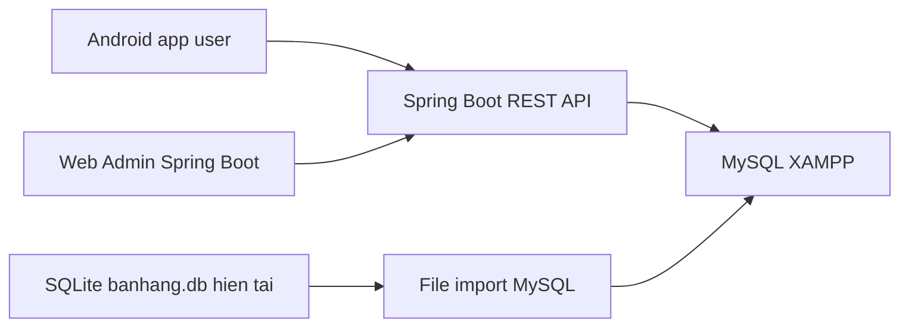

# Flow toi uu du an App ban hoa 9 FLOWER

Ngay lap: 2026-06-16

## Cap nhat flow moi - Web Admin + Backend Spring Boot

Ngay cap nhat: 2026-06-16

Quyet dinh moi:

- Android `AppShopBanHang` se la app danh cho user.
- Admin khong tiep tuc nam trong Android app; admin se chuyen sang web backend rieng.
- Backend dung Spring Boot, MySQL tren XAMPP.
- SQLite hien tai chi dung lam nguon doi chieu schema va du lieu mau de tao file import MySQL.
- Sau khi backend on dinh, app Android se goi API tu backend thay vi doc/ghi truc tiep SQLite.
- VNPAY tam thoi chua tich hop; se xu ly sau khi backend va luong don hang on dinh.

Kien truc muc tieu:

Pham vi backend can hoan thien:

- Auth user/admin dua tren bang `taikhoan`.
- API public cho app Android:
  - Lay danh muc san pham.
  - Lay danh sach san pham, tim kiem, loc theo danh muc.
  - Lay chi tiet san pham va anh.
  - Tao don hang va chi tiet don hang.
  - Lay don hang cua user.
  - Lay va gui danh gia san pham.
- API admin/web admin:
  - Quan ly tai khoan.
  - Quan ly danh muc.
  - Quan ly san pham.
  - Quan ly don hang va cap nhat trang thai.
  - Xem/xoa danh gia neu can.
- Database MySQL:
  - Tao schema tu SQLite: `taikhoan`, `nhomsanpham`, `sanpham`, `Dathang`, `Chitietdonhang`, `DanhGia`.
  - Dung `LONGBLOB` cho cot anh vi SQLite dang co du lieu anh dang byte.
  - Them `Dathang.tendn` de lien ket don hang voi tai khoan user, trong khi van giu `tenkh` de tuong thich du lieu cu.

Thu tu lam moi:

1. Doc schema va du lieu tu `app/src/main/assets/banhang.db`.
2. Tao file SQL import MySQL cho XAMPP.
3. Tao module backend Spring Boot rieng trong project.
4. Tao entity/repository/service/controller theo schema.
5. Build backend bang Maven.
6. Sau khi user duyet, chuyen Android tu SQLite sang goi REST API.
7. Sau cung moi tich hop VNPAY vao luong tao/thanh toan don hang.

Trang thai thuc hien cap nhat:

- [x] Da tao SQL MySQL tu SQLite: `database/mysql/appshopbanhang_mysql.sql`.
- [x] Da import vao MySQL XAMPP database `appshopbanhang`.
- [x] Da tao backend trong project Android: `web-admin`.
- [x] Da tao web admin bang Spring Boot + Thymeleaf.
- [x] Da tao REST API nen cho Android user.
- [x] Da build backend thanh cong bang `mvn -DskipTests package`.
- [x] Da chay thu `http://localhost:8080/admin/login`.
- [x] Da test login admin `admin/1234`, dashboard, trang san pham va anh.
- [x] Da tich hop VNPAY sandbox vao backend `web-admin`.
- [x] Da them API tao thanh toan: `POST /api/payments/vnpay/create`.
- [x] Da them API tao don hang kem thanh toan: `POST /api/payments/vnpay/create-order`.
- [x] Da them callback: `GET /api/payments/vnpay/return` va `GET /api/payments/vnpay/ipn`.
- [x] Da them cot thanh toan VNPAY vao file import MySQL `database/mysql/appshopbanhang_mysql.sql`.
- [x] Da test tao URL sandbox co `vnp_SecureHash` va gia lap IPN checksum hop le tra `00 Confirm Success`.

Duong dan quan trong:

- Web admin source: `C:\Users\ADMIN\Downloads\AppShopBanHang\web-admin`
- SQL MySQL: `C:\Users\ADMIN\Downloads\AppShopBanHang\database\mysql\appshopbanhang_mysql.sql`
- Anh MySQL/web admin: `C:\Users\ADMIN\Downloads\AppShopBanHang\web-admin\uploads\images`
- Cot thanh toan VNPAY da nam trong SQL MySQL chinh.
- Huong dan chay: `C:\Users\ADMIN\Downloads\AppShopBanHang\web-admin\README.md`

## 1. Pham vi da ra soat

- Workspace goc: `C:\Users\ADMIN\Downloads\app + csdl + báo cáo app bán hoa 9 FLOWER`
- Android project: `AppShopBanHang\AppShopBanHang`
- Database kem theo workspace: `banhang.db`
- Cac artifact khac: `AppShopBanHang.rar`, `Báo cáo android_java.docx`, PDF huong dan QR, anh kich thuoc may ao.

Ghi chu build:

- Build truc tiep tai duong dan hien tai bi Android Gradle Plugin chan do path Windows co ky tu non-ASCII: `báo cáo`, `bán hoa`.
- Da tao ban copy tam tai path ASCII va chay `.\gradlew.bat :app:assembleDebug`: build thanh cong.
- Khuyen nghi lam viec tai duong dan ASCII ngan, vi du `C:\Projects\AppShopBanHang`, hoac them `android.overridePathCheck=true` vao `gradle.properties` neu chap nhan rui ro path tren Windows.

## 2. Cong nghe dang su dung

- Native Android app, ngon ngu Java.
- Gradle Kotlin DSL: `settings.gradle.kts`, `build.gradle.kts`, `app\build.gradle.kts`.
- Android Gradle Plugin: `8.7.2`.
- Java compatibility: Java 11.
- SDK:
  - `compileSdk = 35`
  - `targetSdk = 34`
  - `minSdk = 24`
- Thu vien AndroidX/Material:
  - AppCompat `1.7.0`
  - Material Components `1.12.0`
  - Activity KTX/AndroidX Activity `1.10.1`
  - ConstraintLayout `2.2.1`
  - Navigation Fragment/UI `2.8.9`
- UI:
  - XML layouts.
  - `AppCompatActivity`.
  - `ListView`, `GridView`, `RecyclerView`, `ViewPager2`.
  - ViewBinding da bat trong Gradle nhung code hien chu yeu van dung `findViewById`.
- Local data:
  - SQLite qua `SQLiteOpenHelper`.
  - `SharedPreferences` de luu trang thai dang nhap va `tendn`.
  - Gio hang dang luu trong singleton RAM `GioHangManager`.
- Test dependencies co khai bao:
  - JUnit 4.
  - AndroidX JUnit.
  - Espresso.

## 3. To chuc code hien tai

Tat ca source Java dang nam chung trong package:

`app\src\main\java\com\example\appshopbanhang`

Nhom file chinh:

- Entry/splash/auth:
  - `MainActivity.java`
  - `Login_Activity.java`
  - `DangKiTaiKhoan_Activity.java`
  - `DoiMatKhau_Activity.java`
- Man hinh nguoi dung:
  - `TrangchuNgdung_Activity.java`
  - `TatCaSanPham_Activity.java`
  - `TimKiemSanPham_Activity.java`
  - `DanhMucSanPham_Activity.java`
  - `ChiTietSanPham_Activity.java`
  - `GioHang_Activity.java`
  - `DonHang_User_Activity.java`
  - `TrangCaNhan_nguoidung_Activity.java`
  - `ChatBox_Actitvity.java`
- Man hinh admin:
  - `TrangchuAdmin_Activity.java`
  - `Sanpham_admin_Activity.java`
  - `Nhomsanpham_admin_Actvity.java`
  - `Taikhoan_admin_Activity.java`
  - `DonHang_admin_Activity.java`
  - Cac man hinh them/sua san pham, nhom san pham, tai khoan.
- Data/model:
  - `Database.java`
  - `DatabaseHelper.java`
  - `OrderManager.java`
  - `GioHangManager.java`
  - `SanPham.java`, `NhomSanPham.java`, `TaiKhoan.java`, `Order.java`, `GioHang.java`, `ChiTietDonHang.java`, `DanhGiaSanPham.java`, ...
- Adapter:
  - Cac adapter dang dung `BaseAdapter`, `ArrayAdapter`, mot phan dung `RecyclerView.Adapter`.
- Resource:
  - `app\src\main\res\layout`: 47 layout XML.
  - `app\src\main\res\drawable`: 89 drawable/image.
  - `app\src\main\res\navigation`: co `nav_graph.xml`, `nav_graph2.xml` dang giong template va chua thay Fragment tuong ung.

Nhan xet to chuc:

- Code dang theo kieu Activity truc tiep xu ly UI, query DB, validation, dieu huong va nghiep vu.
- Chua tach ro cac lop `repository/service/session/router`.
- Schema SQLite duoc tao rai rac trong nhieu Activity, dong thoi co 2 helper DB la `Database` va `DatabaseHelper`.
- Cac class, bien, layout ID tron lan tieng Viet khong dau, tieng Viet co dau, tieng Anh va mot so typo: `Actitvity`, `Nhomsanpham_admin_Actvity`, `QueryDulieu`.

## 4. Schema SQLite dang co trong `banhang.db`

Database file workspace co 8 table:

- `taikhoan`
  - `tendn VARCHAR(20) PRIMARY KEY`
  - `matkhau VARCHAR(50)`
  - `quyen VARCHAR(50)`
  - Dang co 6 rows.
- `nhomsanpham`
  - `maso INTEGER PRIMARY KEY AUTOINCREMENT`
  - `tennsp NVARCHAR(200)`
  - `anh BLOB`
  - Dang co 10 rows.
- `sanpham`
  - `masp INTEGER PRIMARY KEY AUTOINCREMENT`
  - `tensp NVARCHAR(200)`
  - `dongia FLOAT`
  - `mota TEXT`
  - `ghichu TEXT`
  - `soluongkho INTEGER`
  - `maso INTEGER`
  - `anh BLOB`
  - Dang co 27 rows.
- `Dathang`
  - `id_dathang INTEGER PRIMARY KEY AUTOINCREMENT`
  - `tenkh TEXT`
  - `diachi TEXT`
  - `sdt TEXT`
  - `tongthanhtoan REAL`
  - `ngaydathang DATETIME DEFAULT CURRENT_TIMESTAMP`
  - `trangthai TEXT`
  - Dang co 8 rows.
- `Chitietdonhang`
  - `id_chitiet INTEGER PRIMARY KEY AUTOINCREMENT`
  - `id_dathang INTEGER`
  - `masp INTEGER`
  - `soluong INTEGER`
  - `dongia REAL`
  - `anh TEXT`
  - Dang co 21 rows.
- `DanhGia`
  - `id_danhgia INTEGER PRIMARY KEY AUTOINCREMENT`
  - `masp TEXT`
  - `id_chitiet TEXT`
  - `noidung TEXT`
  - `tendn TEXT`
  - `sao1..sao5 TEXT`
  - Dang co 10 rows.
- `android_metadata`, `sqlite_sequence`.

Diem can doi chieu:

- Code co noi lay `anh` cua `Chitietdonhang` bang `getBlob`, nhung schema DB hien tai khai bao `anh TEXT`.
- Database o workspace goc chua nam trong `app\src\main\assets`; neu cai app tren may moi, app se tao DB rong theo code, khong tu co san data mau.

## 5. Luong nghiep vu hien tai

### 5.1 Khoi dong va dang nhap

1. `MainActivity` hien splash khoang 5 giay.
2. Chuyen sang `Login_Activity`.
3. Login query truc tiep table `taikhoan` theo `tendn` va `matkhau`.
4. Neu `quyen = admin`, chuyen `TrangchuAdmin_Activity`.
5. Neu `quyen = user`, chuyen `TrangchuNgdung_Activity`.
6. Luu `tendn` va `isLoggedIn` vao `SharedPreferences`.

Van de can toi uu:

- Mat khau dang luu/query plain text.
- Timer auto logout chi nam trong `Login_Activity`; khi da qua Activity khac, viec quan ly session chua tap trung.
- Nhieu man hinh lap lai logic kiem tra `SharedPreferences`.

### 5.2 Luong nguoi dung mua hang

1. `TrangchuNgdung_Activity` load nhom san pham va san pham tu SQLite.
2. Nguoi dung xem danh muc, tim kiem, xem tat ca san pham hoac vao chi tiet san pham.
3. `ChiTietSanPham_Activity` hien thong tin san pham, danh gia va nut them gio hang.
4. Gio hang luu trong `GioHangManager` singleton RAM.
5. `GioHang_Activity` hien danh sach gio hang, tong tien.
6. Thanh toan mo dialog nhap ten, dia chi, sdt.
7. Mo dialog QR, bam thanh toan thanh cong thi tao `Dathang` va `Chitietdonhang`.
8. Xoa gio hang trong RAM, quay ve trang chu.

Van de can toi uu:

- Gio hang mat khi process bi kill, app restart, hoac can dong bo nhieu session.
- Chua tru ton kho khi dat hang thanh cong.
- QR/payment chi la xac nhan thu cong, chua co trang thai giao dich ro rang.
- Gia tien dung `float`, nen doi sang `long` VND hoac `BigDecimal`.

### 5.3 Luong don hang va danh gia

1. User vao `DonHang_User_Activity` de xem don theo `tenkh`.
2. Bam chi tiet don hang de xem `Chitietdonhang`.
3. Sau trang thai phu hop, user co the danh gia san pham.
4. Admin vao `DonHang_admin_Activity` xem tat ca don va chi tiet.

Van de can toi uu:

- Lien ket user voi don hang dang dua theo `tenkh`, nen de nham neu trung ten hoac ten thay doi.
- Can dung ma tai khoan/user id lam khoa ngoai.
- Trang thai don nen dung enum/constant, khong hard-code chuoi o nhieu noi.

### 5.4 Luong admin

1. Admin dang nhap vao `TrangchuAdmin_Activity`.
2. Quan ly san pham, nhom san pham, tai khoan, don hang.
3. Them/sua/xoa dang thuc hien truc tiep trong Activity/Adapter.

Van de can toi uu:

- SQL string noi chuoi con ton tai o nhieu chuc nang them/sua/xoa.
- Validation form chua thong nhat.
- Admin va user dung nhieu navigation code lap lai.

## 6. Van de uu tien can xu ly

### P0 - On dinh moi truong va du lieu

- Dua project sang path ASCII ngan, vi du `C:\Projects\AppShopBanHang`.
- Dua `banhang.db` vao `app\src\main\assets` neu app can co data mau khi cai moi.
- Viet ro cach copy DB lan dau vao internal storage, hoac tao seed data bang migration.
- Hop nhat schema trong mot noi duy nhat.
- Doi `Chitietdonhang.anh` ve cung kieu du lieu voi code: neu luu anh binary thi dung `BLOB`, neu luu path thi code dung `TEXT`.

### P1 - An toan va dung du lieu

- Thay cac query noi chuoi bang parameterized query/`ContentValues`.
- Hash mat khau truoc khi luu, toi thieu dung salted hash.
- Tach `SessionManager` quan ly `SharedPreferences`, role, logout.
- Doi lien ket don hang tu `tenkh` sang `user_id`/`tendn`.
- Dung transaction khi tao order + order details + cap nhat ton kho.
- Dung constant cho ten table, column, order status.

### P2 - To chuc code de de bao tri

- Tach package:
  - `data/db`: `AppDatabaseHelper`, schema constants, migration.
  - `data/repository`: `ProductRepository`, `OrderRepository`, `UserRepository`, `ReviewRepository`.
  - `domain/model`: model data.
  - `ui/user`, `ui/admin`, `ui/auth`.
  - `ui/adapter`.
  - `core/session`, `core/navigation`, `core/util`.
- Hop nhat `Database.java` va `DatabaseHelper.java` thanh mot helper/repository.
- Dua logic load list ra repository, Activity chi render UI va nhan event.
- Dung ViewBinding that su de giam `findViewById`.
- Chuan hoa ten class/file: bo typo `Actitvity`, thong nhat `Activity`.

### P3 - UI/UX va hieu nang

- Thay dan `ListView/GridView` bang `RecyclerView` cho cac danh sach lon.
- Dung ViewHolder pattern chuan cho adapter con lai.
- Giam viec luu anh san pham bang BLOB trong DB neu anh lon; can nhac luu file/path va decode co resize.
- Format tien VND bang `NumberFormat`, khong hien raw float.
- Chuan hoa theme/color/string resource, bo string/template lorem ipsum khong dung.
- Kiem tra layout co height co dinh qua lon, vi du mot so `GridView` height hang nghin dp.

### P4 - Don dep cau hinh va artifact

- Xoa hoac sua `nav_graph.xml`, `nav_graph2.xml` neu khong dung Navigation Component.
- Neu khong dung Navigation Component, bo dependency `navigation-fragment` va `navigation-ui`.
- Bo resource/string template `FirstFragment`, `SecondFragment`, `lorem_ipsum` neu khong dung.
- Dam bao `.gitignore` loai tru `build/`, `.gradle/`, `.idea/`, `local.properties`.
- Khong commit `.rar`, `.docx`, DB production neu chuyen sang source control, tru khi co ly do ro.

## 7. Flow de toi uu theo dot

### Dot 1 - Chuan hoa nen tang

- [ ] Di chuyen/copy project sang path ASCII.
- [ ] Build lai `.\gradlew.bat :app:assembleDebug`.
- [ ] Lap file `README.md` huong dan mo project, SDK, tai khoan demo, DB demo.
- [ ] Dua DB demo vao `assets` hoac viet seed/migration.
- [ ] Chot schema dung: table, column, kieu du lieu, foreign key.

Ket qua mong doi:

- Dev moi clone/mo project co the build va chay app.
- App cai moi co du data demo hoac co flow tao data ro rang.

### Dot 2 - Gom tang data

- [ ] Tao `DbContract` chua ten table/column/status.
- [ ] Hop nhat `Database` va `DatabaseHelper`.
- [ ] Tao repository cho tai khoan, san pham, nhom san pham, don hang, danh gia.
- [ ] Chuyen cac query trong Activity sang repository.
- [ ] Thay query noi chuoi bang query co tham so.
- [ ] Them transaction cho flow dat hang.

Ket qua mong doi:

- Activity ngan hon.
- SQL tap trung, de test va de sua schema.
- Giam nguy co loi du lieu va SQL injection.

### Dot 3 - Chuan hoa auth/session

- [ ] Tao `SessionManager`.
- [ ] Doi login/logout/profile/navigation dung chung `SessionManager`.
- [ ] Doi mat khau sang hash.
- [ ] Doi don hang gan voi user id/tendn thay vi ten khach hang tu form.
- [ ] Them guard cho man hinh admin: khong chi dua vao man hinh login.

Ket qua mong doi:

- Dang nhap/dang xuat dong nhat.
- Phan quyen ro hon, it lap code.

### Dot 4 - Chuan hoa UI va navigation

- [ ] Tao helper/base method cho bottom navigation user.
- [ ] Tao helper/base method cho navigation admin.
- [ ] Chuyen cac view sang ViewBinding theo tung man hinh.
- [ ] Thay cac list quan trong bang RecyclerView.
- [ ] Chuan hoa format tien, empty state, validation message.

Ket qua mong doi:

- Giao dien it bug, code Activity de doc hon.
- Danh sach scroll tot hon.

### Dot 5 - Kiem thu va dong goi

- [ ] Them unit test cho repository: login, search product, create order.
- [ ] Them instrumentation/Espresso smoke test: login user, xem san pham, them gio, dat hang.
- [ ] Test admin: them/sua/xoa san pham, cap nhat don hang.
- [ ] Chay lint va assemble debug/release.
- [ ] Kiem tra backup/data extraction rules neu co thong tin nhay cam.

Ket qua mong doi:

- Co checklist test truoc khi nop/demo.
- Giam rui ro sua mot man hinh lam hong man hinh khac.

## 8. Checklist ra soat nhanh cho ban

- [ ] Co muon app cai moi tu dong co san du lieu mau trong `banhang.db` khong?
- [ ] Co chap nhan di chuyen project sang path ASCII de build on dinh khong?
- [ ] Muon toi uu theo huong nhe nha Java/XML hien tai, hay refactor lon sang MVVM/Room/RecyclerView?
- [ ] Co can giu nguyen giao dien hien tai cho bao cao/demo khong?
- [ ] Co can them README huong dan chay app va tai khoan demo khong?

## 9. De xuat thu tu lam viec ngan gon

1. Fix moi truong build va DB seed.
2. Hop nhat database helper + repository.
3. Sua cac query noi chuoi, hash mat khau, session manager.
4. Sua flow dat hang bang transaction va cap nhat ton kho.
5. Don resource/navigation thua.
6. Cai thien UI list/search/cart theo tung man hinh.
7. Them README va test smoke flow.
