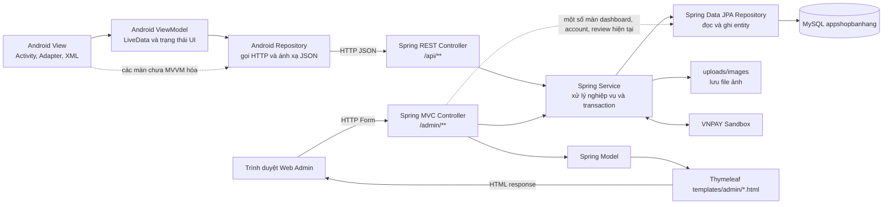
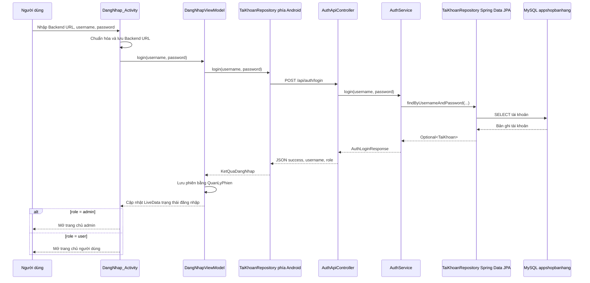
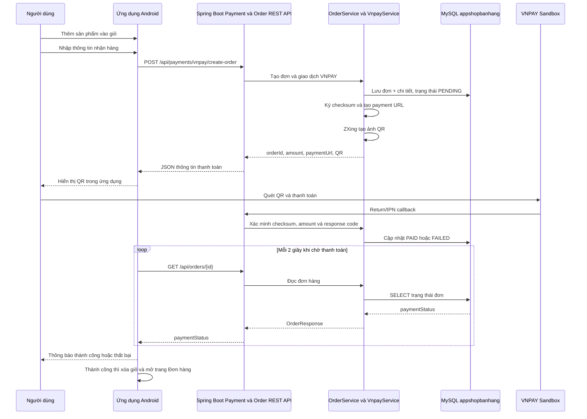
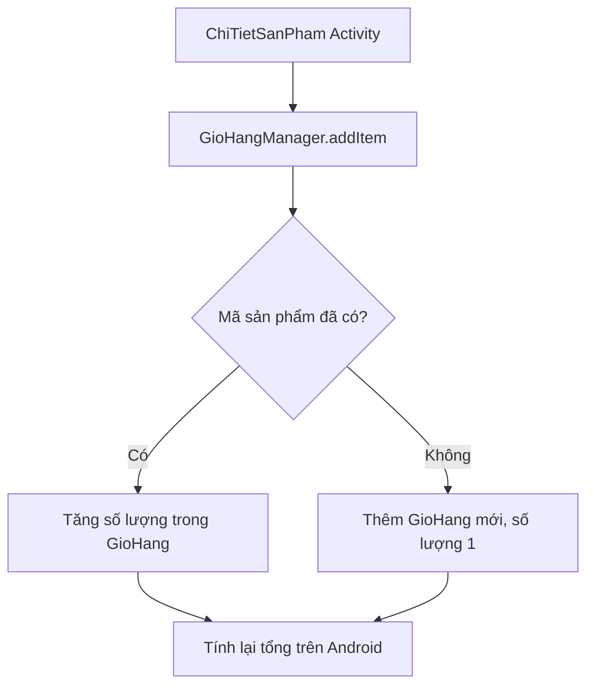
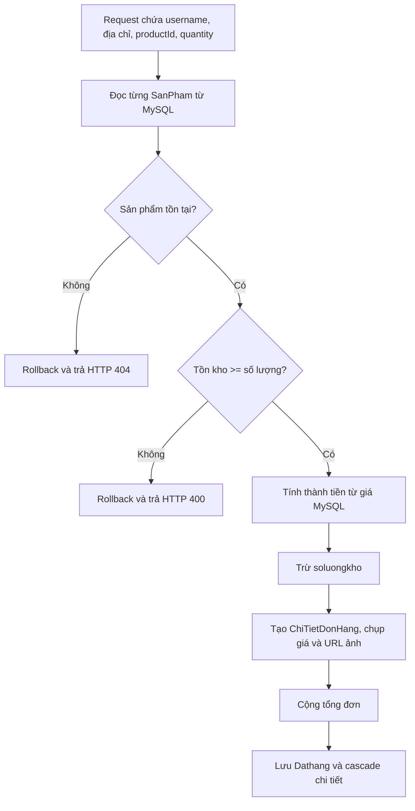
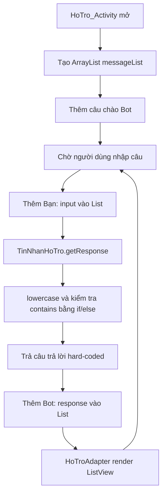
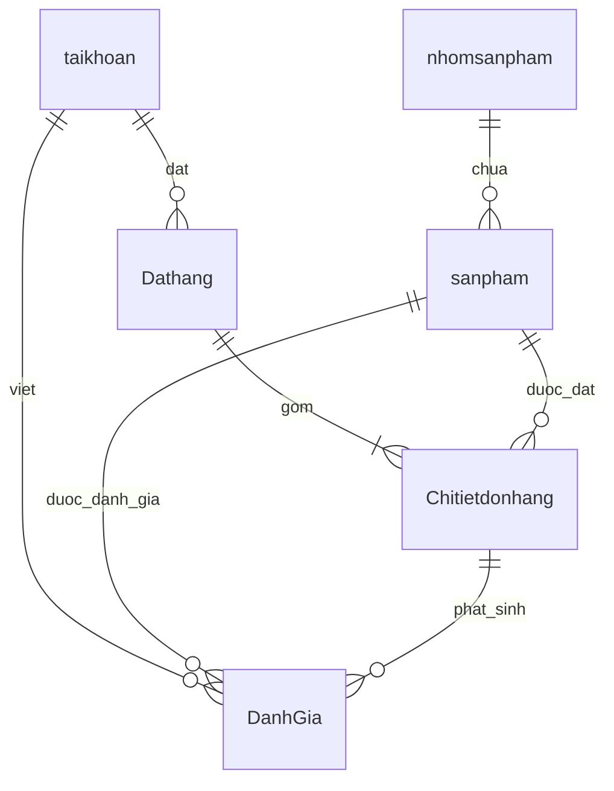

# AppShopBanHang

Hệ thống bán hoa gồm ứng dụng Android cho khách hàng/quản trị viên và Spring Boot Web Admin cung cấp REST API, giao diện quản trị, xử lý MySQL, ảnh và thanh toán VNPAY Sandbox.

README này được lưu giống nhau trong cả hai project để có thể đọc từ Android Studio hoặc IntelliJ IDEA.

## 1. Cấu trúc hệ thống

| Thành phần | Đường dẫn | Vai trò |
|---|---|---|
| Android App | `C:\Users\ADMIN\AndroidStudioProjects\AppShopBanHang` | Giao diện người dùng và giao diện admin trên Android |
| Spring Boot Web Admin | `C:\Users\ADMIN\IdeaProjects\AppShopBanHang` | Web admin, REST API, nghiệp vụ, VNPAY và truy cập MySQL |
| MySQL | XAMPP, cổng `3306` | Lưu tài khoản, sản phẩm, đơn hàng và đánh giá |
| Ảnh | `C:\Users\ADMIN\IdeaProjects\AppShopBanHang\uploads\images` | Lưu file ảnh; SQL chỉ lưu URL/đường dẫn ảnh |
| Database script | `C:\Users\ADMIN\IdeaProjects\AppShopBanHang\database\mysql` | Tạo lại schema và dữ liệu mẫu |



Nguyên tắc quan trọng:

- Android không kết nối trực tiếp MySQL. Android Repository gọi REST API; JPA Repository phía Spring Boot mới truy cập database.
- Trình duyệt không thể gọi JPA Repository trực tiếp. Đa số request đi qua MVC Controller, Service rồi tới Repository; một số Controller quản trị hiện còn gọi Repository trực tiếp.
- File ảnh nằm trong `uploads/images`; MySQL chỉ lưu URL hoặc đường dẫn ảnh.
- VNPAY là hệ thống bên ngoài. `VnpayService` tạo URL/QR và xử lý callback trước khi cập nhật đơn hàng.

## 2. Công nghệ và phân bổ kiến trúc

### 2.1 Kết luận kiến trúc cần nhớ

Không nên trả lời rằng toàn bộ hệ thống dùng chung một mô hình MVVM.

| Thành phần | Kiến trúc thực tế | Cách trả dữ liệu |
|---|---|---|
| Android User và Android Admin | MVVM từng phần kết hợp Activity gọi Repository trực tiếp | REST API trả JSON |
| Web Admin | Spring MVC phía server; phân tầng Service chưa tuyệt đối | Thymeleaf trả HTML |
| REST API | Chủ yếu Controller - Service - Repository | DTO được serialize thành JSON |
| Tầng dữ liệu backend | Spring Data JPA | Entity ánh xạ với MySQL |

Android đã có `AndroidViewModel`, `LiveData` và Repository ở các luồng đăng nhập, danh sách sản phẩm và danh sách đơn hàng. Tuy nhiên, giỏ hàng, VNPAY, đánh giá, chat và nhiều màn CRUD vẫn gọi Repository/manager trực tiếp từ Activity hoặc Adapter. Vì vậy cách gọi đúng nhất là **MVVM từng phần**, chưa phải MVVM thuần trên toàn ứng dụng.

Web Admin không dùng Android ViewModel. Web dùng **Spring MVC**: Controller nhận request, Service xử lý nghiệp vụ, JPA Repository truy cập MySQL, Controller đưa dữ liệu vào Spring `Model`, sau đó Thymeleaf render HTML.

### 2.2 Công nghệ Android

- Java, Android SDK.
- ViewBinding, AppCompat, Material Components.
- `AndroidViewModel`, `LiveData`, `MutableLiveData` cho các module đã MVVM hóa.
- `HttpURLConnection` thông qua `ApiClient`.
- `SharedPreferences` lưu phiên đăng nhập và Backend API URL.
- `ExecutorService` chạy request mạng ngoài UI thread.

### 2.3 Công nghệ Backend

- Java 21.
- Spring Boot 3.4.5.
- Spring MVC, Thymeleaf, Validation.
- Spring Data JPA.
- MariaDB JDBC Driver cho MySQL/MariaDB của XAMPP.
- ZXing tạo ảnh QR VNPAY.
- Maven.

### 2.4 Phân bổ MVVM trong Android

Package gốc:

```text
com.example.appshopbanhang
|-- core
|   |-- image
|   |-- network
|   |-- session
|   `-- util
|-- data
|   |-- model
|   `-- repository
`-- ui
    |-- account, auth, cart, category, home
    |-- order, payment, product, support
    `-- adapter
```

#### View: Activity, Adapter và XML

View nhận thao tác, quan sát state, hiển thị dữ liệu và điều hướng. Các package View nằm trong `com.example.appshopbanhang.ui`:

| Package | Màn hình tiêu biểu | Trách nhiệm View |
|---|---|---|
| `ui.auth` | `DangNhap_Activity`, `DangKiTaiKhoan_Activity`, `DoiMatKhau_Activity` | đọc form đăng nhập/đăng ký, hiển thị lỗi và điều hướng theo quyền |
| `ui.home` | `TrangchuNgdung_Activity`, `TrangchuAdmin_Activity` | hiển thị trang chủ cho user/admin |
| `ui.product` | danh sách, tìm kiếm, chi tiết và CRUD sản phẩm | nhận thao tác sản phẩm và render danh sách/chi tiết |
| `ui.category` | danh sách và CRUD danh mục | quản lý giao diện nhóm sản phẩm |
| `ui.cart` | `GioHang_Activity` | hiển thị giỏ, số lượng, tổng tiền và bắt đầu checkout |
| `ui.payment` | `VnpayPayment_Activity` | hiển thị QR, polling trạng thái và trả kết quả về giỏ hàng |
| `ui.order` | danh sách/chi tiết đơn user và admin | hiển thị đơn và nhận thao tác cập nhật trạng thái |
| `ui.account` | hồ sơ và CRUD tài khoản | hiển thị/cập nhật tài khoản |
| `ui.support` | `HoTro_Activity` | giao diện chat hỗ trợ cục bộ |
| `ui.adapter` | các RecyclerView Adapter | bind model vào từng item; một số adapter hiện còn gọi Repository trực tiếp |

Các file XML trong `app/src/main/res/layout` cũng là một phần của View. Activity/Adapter không phải Model và không nên viết SQL.

#### ViewModel: giữ state của màn hình

Hiện dự án có ba ViewModel chính:

| ViewModel | Repository được gọi | State công khai | View đang sử dụng |
|---|---|---|---|
| `DangNhapViewModel` | `TaiKhoanRepository` | `LiveData<TrangThaiDangNhapUi>` | `DangNhap_Activity` |
| `DanhSachSanPhamViewModel` | `SanPhamRepository` | danh sách sản phẩm và thông báo | `TatCaSanPham_Activity`, `DanhMucSanPham_Activity`, `TimKiemSanPham_Activity` |
| `DanhSachDonHangViewModel` | `DonHangRepository` | danh sách đơn và thông báo | `DonHang_User_Activity`, `DonHang_admin_Activity` |

ViewModel thực hiện các việc sau:

1. nhận yêu cầu từ Activity;
2. chạy Repository bằng `ExecutorService` để không chặn UI thread;
3. giữ kết quả trong `MutableLiveData` private;
4. công khai `LiveData` để Activity observe;
5. phát dữ liệu hoặc thông báo lỗi để View render lại.

`DangNhapViewModel` còn gọi `QuanLyPhien` sau khi backend xác thực thành công. Session chỉ được lưu khi API trả đăng nhập hợp lệ.

#### Model: dữ liệu Android sử dụng

Package `com.example.appshopbanhang.data.model` chứa các POJO:

- `TaiKhoan`, `SanPham`, `ChiTietSanPham`, `NhomSanPham`;
- `DonHang`, `ChiTietDonHang`;
- `DanhGiaSanPham`;
- `GioHang`;
- `VnpayPayment`;
- `KetQuaDangNhap`;
- `TinNhanHoTro`.

`TrangThaiDangNhapUi` nằm trong `ui.auth` và biểu diễn state riêng của màn đăng nhập. Các model Android không phải JPA Entity và không tự truy cập MySQL. Chúng biểu diễn dữ liệu JSON hoặc trạng thái cục bộ mà UI cần dùng.

#### Repository Android: cổng dữ liệu của ứng dụng

Package `com.example.appshopbanhang.data.repository`:

| Repository/Manager | Nguồn dữ liệu | Vai trò |
|---|---|---|
| `TaiKhoanRepository` | REST API | đăng nhập, đăng ký và CRUD tài khoản |
| `SanPhamRepository` | REST API | đọc/CRUD sản phẩm và danh mục |
| `DonHangRepository` | REST API | tạo/đọc/cập nhật đơn và gọi API VNPAY |
| `DanhGiaRepository` | REST API | đọc và gửi đánh giá |
| `GioHangManager` | RAM trong process Android | giữ danh sách sản phẩm giỏ hàng bằng Singleton |

Repository Android dùng `ApiClient`/`HttpURLConnection`; nó **không phải** Spring Data JPA Repository. `GioHangManager` cũng không gọi backend nên giỏ hàng mất khi process ứng dụng bị hủy.

#### Core: hạ tầng dùng chung

| Package/lớp | Vai trò |
|---|---|
| `core.network.ApiConfig` | đọc/lưu Backend API URL và chuẩn hóa base URL |
| `core.network.ApiClient` | gửi HTTP request, nhận response và xử lý JSON |
| `core.session.QuanLyPhien` | lưu username, role và trạng thái đăng nhập trong `SharedPreferences` |
| `core.image.HinhAnhUtils` | chuẩn hóa/tải dữ liệu ảnh cho UI |
| `core.util.MoneyFormatter` | định dạng số tiền theo tiền Việt Nam |

### 2.5 Chu trình dữ liệu MVVM trên Android

Ví dụ đăng nhập:

```text
Người dùng bấm Đăng nhập
    -> DangNhap_Activity đọc username/password
    -> DangNhapViewModel.login()
    -> TaiKhoanRepository.login()
    -> ApiClient gửi POST /api/auth/login
    -> AuthApiController
    -> AuthService
    -> TaiKhoanRepository của Spring Data JPA
    -> MySQL bảng taikhoan
    -> backend trả AuthLoginResponse dạng JSON
    -> Android TaiKhoanRepository ánh xạ thành KetQuaDangNhap
    -> DangNhapViewModel lưu QuanLyPhien và cập nhật LiveData
    -> DangNhap_Activity observe state và chuyển màn hình
```

Ví dụ tải danh sách sản phẩm:

```text
TatCaSanPham_Activity
    -> DanhSachSanPhamViewModel.loadAllProducts()
    -> SanPhamRepository.getAllProducts()
    -> GET /api/products
    -> CatalogApiController
    -> CatalogService
    -> SanPhamRepository của Spring Data JPA
    -> MySQL bảng sanpham
    -> ProductResponse JSON
    -> ViewModel cập nhật LiveData<ArrayList<SanPham>>
    -> Activity observe và giao danh sách cho RecyclerView Adapter
```

Phân chia trách nhiệm chuẩn:

- Activity chỉ nhận sự kiện, observe `LiveData`, render và điều hướng.
- ViewModel giữ trạng thái màn hình và điều phối Repository.
- Repository che giấu HTTP, URL và JSON khỏi ViewModel.
- REST Controller nhận request từ Android.
- Spring Service xử lý quy tắc nghiệp vụ.
- JPA Repository mới là lớp truy cập MySQL.

### 2.6 Những module Android chưa đi đủ chu trình MVVM

| Module | Cách code hiện tại | Nhận xét khi vấn đáp |
|---|---|---|
| Đăng nhập | Activity -> ViewModel -> Repository | đã theo MVVM |
| Danh sách/tìm kiếm sản phẩm | Activity -> ViewModel -> Repository | đã theo MVVM |
| Danh sách đơn user/admin | Activity -> ViewModel -> Repository | đã theo MVVM |
| Trang chủ và CRUD sản phẩm/danh mục/tài khoản | Activity/Adapter -> Repository | chưa có ViewModel riêng |
| Giỏ hàng | Activity/Adapter -> `GioHangManager` | state nằm trong Singleton RAM |
| Thanh toán VNPAY | Activity -> `DonHangRepository` | polling và điều phối thanh toán còn ở Activity |
| Chi tiết/cập nhật đơn | Activity/Adapter -> `DonHangRepository` | chưa có ViewModel riêng |
| Đánh giá | Activity/Adapter -> `DanhGiaRepository` | chưa có ViewModel riêng |
| Chat hỗ trợ | Activity -> `TinNhanHoTro.getResponse()` | xử lý cục bộ, không có Repository/backend |

Câu trả lời trung thực khi được hỏi “App có dùng MVVM không?”:

> App áp dụng MVVM theo từng phần. Các luồng đăng nhập, danh sách sản phẩm và danh sách đơn đã có ViewModel + LiveData + Repository. Một số feature cũ vẫn là Activity gọi Repository trực tiếp, nên dự án chưa thuần MVVM toàn bộ.

### 2.7 Phân bổ Spring MVC và các tầng Backend

Package gốc:

```text
com.appshopbanhang.admin
|-- config
|-- controller
|   |-- admin
|   `-- api
|-- dto
|-- entity
|-- repository
`-- service
```

#### Controller Web Admin: nhận form và trả View

Package `com.appshopbanhang.admin.controller.admin` dùng `@Controller`:

| Controller | Chức năng |
|---|---|
| `AdminAuthController` | đăng nhập, đăng xuất và session web admin |
| `AdminDashboardController` | thống kê dashboard; hiện gọi các JPA Repository trực tiếp để đếm dữ liệu |
| `AdminProductController` | danh sách, thêm và xóa sản phẩm |
| `AdminCategoryController` | danh sách, thêm và xóa danh mục |
| `AdminAccountController` | quản lý tài khoản; hiện gọi `TaiKhoanRepository` trực tiếp |
| `AdminOrderController` | danh sách, chi tiết và cập nhật trạng thái đơn |
| `AdminPaymentController` | tạo giao dịch VNPAY cho đơn |
| `AdminReviewController` | danh sách và xóa đánh giá; hiện gọi `DanhGiaRepository` trực tiếp |

Controller đọc form/path variable, gọi Service, thêm dữ liệu vào Spring `Model`, trả tên template hoặc `redirect:`. Web Admin dùng `HttpSession` với `AdminSession` và `AdminAuthInterceptor`; dự án hiện không dùng Spring Security.

#### REST Controller: nhận JSON và trả JSON

Package `com.appshopbanhang.admin.controller.api` dùng `@RestController`:

| REST Controller | Nhóm endpoint |
|---|---|
| `AuthApiController` | `/api/auth/**` |
| `CatalogApiController` | `/api/categories`, `/api/products/**` |
| `OrderApiController` | `/api/orders/**` |
| `ReviewApiController` | `/api/reviews/**` |
| `PaymentApiController` | `/api/payments/vnpay/**` |
| `AdminApiController` | `/api/admin/**` cho Android Admin CRUD; phần tài khoản hiện gọi JPA Repository trực tiếp |
| `ImageApiController` | endpoint đọc ảnh danh mục/sản phẩm/chi tiết đơn |

`@RestController` không chọn template Thymeleaf. Giá trị trả về được Spring/Jackson serialize thành JSON cho Android, trừ VNPAY return endpoint có thể trả HTML kết quả thanh toán.

#### Service: nghiệp vụ dùng chung

Package `com.appshopbanhang.admin.service`:

| Service | Trách nhiệm |
|---|---|
| `AuthService` | xác thực đăng nhập và kiểm tra quyền admin |
| `CatalogService` | đọc/CRUD sản phẩm, danh mục và chuẩn hóa giá/ảnh |
| `OrderService` | tạo đơn, kiểm tra tồn kho, trừ kho, tính tổng và cập nhật trạng thái |
| `ReviewService` | đọc, tạo và xóa đánh giá |
| `VnpayService` | tạo tham số/QR, ký HMAC, xác minh callback và cập nhật thanh toán |
| `ImageStorageService` | lưu file upload vào `uploads/images` và tạo URL ảnh |

Service là nơi nên chứa nghiệp vụ; Controller không nên tự viết SQL hoặc tự tính lại quy tắc thanh toán. Các thao tác nhiều bước như tạo đơn dùng transaction để tránh lưu dữ liệu dở dang.

Hiện trạng phân tầng chưa tuyệt đối:

- `AdminDashboardController` gọi năm Repository để đếm dữ liệu và lấy đơn gần đây;
- `AdminAccountController` gọi `TaiKhoanRepository` để CRUD tài khoản;
- `AdminReviewController` gọi `DanhGiaRepository` để liệt kê/xóa đánh giá;
- `AdminApiController` gọi `TaiKhoanRepository` trực tiếp ở nhóm API tài khoản.

Điều này vẫn chạy đúng Spring MVC, nhưng nếu chuẩn hóa kiến trúc hơn thì nên tạo `DashboardService` và `AccountService`, đồng thời chuyển nghiệp vụ đánh giá web sang `ReviewService`.

#### JPA Repository: truy cập MySQL

Package `com.appshopbanhang.admin.repository`:

| JPA Repository | Entity/bảng chính |
|---|---|
| `TaiKhoanRepository` | `TaiKhoan` / `taikhoan` |
| `NhomSanPhamRepository` | `NhomSanPham` / `nhomsanpham` |
| `SanPhamRepository` | `SanPham` / `sanpham` |
| `DonHangRepository` | `DonHang` / `Dathang` |
| `ChiTietDonHangRepository` | `ChiTietDonHang` / `Chitietdonhang` |
| `DanhGiaRepository` | `DanhGia` / `DanhGia` |

Các interface kế thừa `JpaRepository<Entity, IdType>`. Spring Data JPA tạo implementation lúc chạy, chuyển thao tác Java thành SQL và dùng MariaDB JDBC Driver để giao tiếp MySQL.

#### Entity, DTO và View

- `entity`: ánh xạ bảng bằng `@Entity`, biểu diễn dữ liệu persistence.
- `dto`: request/response dành cho API, giúp Android không phụ thuộc trực tiếp cấu trúc Entity.
- `templates/admin`: View Thymeleaf gồm login, dashboard, products, categories, accounts, orders, order-detail và reviews.
- `static/css/admin.css`: định dạng giao diện web admin.
- `config`: interceptor session, ánh xạ `/images/**`, cấu hình MVC và thuộc tính VNPAY.

### 2.8 Chu trình Spring MVC của Web Admin

Ví dụ Admin cập nhật trạng thái đơn:

```text
Admin chọn trạng thái trên trình duyệt
    -> POST /admin/orders/{id}/status
    -> AdminAuthInterceptor kiểm tra HttpSession
    -> AdminOrderController nhận id và trạng thái
    -> OrderService.updateStatus()
    -> DonHangRepository.findById()/save()
    -> Hibernate phát SQL UPDATE bảng Dathang
    -> Controller redirect về trang chi tiết/danh sách
    -> trình duyệt gửi GET mới
    -> Controller nạp dữ liệu vào Spring Model
    -> Thymeleaf render templates/admin/order-detail.html
    -> HTML trả về trình duyệt
```

Đây là mẫu POST/Redirect/GET. Redirect giúp tránh gửi lại form khi người dùng refresh trang.

### 2.9 Phân biệt hai loại Repository

| Tiêu chí | Repository Android | Repository Spring Boot |
|---|---|---|
| Vị trí | `com.example.appshopbanhang.data.repository` | `com.appshopbanhang.admin.repository` |
| Client/Server | phía client Android | phía backend Spring Boot |
| Công nghệ | `ApiClient`, `HttpURLConnection`, JSON | Spring Data JPA, Hibernate, JDBC |
| Nguồn dữ liệu | REST API hoặc RAM với giỏ hàng | MySQL |
| Có viết SQL trực tiếp không? | không | không; JPA/Hibernate sinh SQL |

Nếu giảng viên hỏi “Repository Android có truy cập database không?”, câu trả lời là **không**. Nó gọi REST API. Chỉ JPA Repository trong backend mới truy cập MySQL.

### 2.10 Câu trả lời vấn đáp ngắn về kiến trúc

> Hệ thống có một app Android cho user và admin, cùng một Spring Boot backend. Android áp dụng MVVM từng phần: Activity là View, ba AndroidViewModel giữ LiveData, Android Repository gọi REST API và model là các POJO. Backend dùng Spring MVC phân tầng: Controller nhận HTTP, Service xử lý nghiệp vụ, Spring Data JPA Repository truy cập MySQL, Entity ánh xạ bảng và DTO trao đổi JSON. Web Admin dùng Controller, Spring Model và Thymeleaf, không dùng Android ViewModel. Android tuyệt đối không kết nối trực tiếp MySQL.

## 3. Chuẩn bị môi trường

1. Cài JDK 21 cho IntelliJ IDEA.
2. Cài Android SDK cho Android Studio.
3. Cài XAMPP và bật **MySQL**.
4. Không cần bật Apache hoặc Tomcat trong XAMPP.
5. Điện thoại và máy tính phải cùng Wi-Fi nếu chạy APK trên thiết bị thật.

Spring Boot dùng Tomcat nhúng. Dòng `Tomcat started on port 8080` trong IntelliJ là bình thường và không phải Tomcat của XAMPP.

## 4. Khởi tạo database

Database mặc định:

- Schema: `appshopbanhang`
- Host: `localhost`
- Port: `3306`
- Username: `root`
- Password: rỗng theo cấu hình XAMPP hiện tại

Import schema bằng PowerShell:

```powershell
cmd /c ""C:\xampp\mysql\bin\mysql.exe" -u root < "C:\Users\ADMIN\IdeaProjects\AppShopBanHang\database\mysql\appshopbanhang_mysql.sql""
```

Các bảng chính:

| Bảng | Nội dung |
|---|---|
| `taikhoan` | Tài khoản và quyền `admin`/`user` |
| `nhomsanpham` | Danh mục hoa |
| `sanpham` | Sản phẩm, giá, mô tả và URL ảnh |
| `Dathang` | Đơn hàng, trạng thái đơn và trạng thái thanh toán |
| `Chitietdonhang` | Sản phẩm, số lượng và giá tại thời điểm đặt |
| `DanhGia` | Nội dung và số sao đánh giá |

Tài khoản web admin mẫu trong SQL:

- Username: `admin`
- Password: `1234`

## 5. Cấu hình IP

IP Wi-Fi đang cấu hình: `192.168.1.199`.

### IntelliJ IDEA

Mở **Run > Edit Configurations > AppShopBanHang Admin Web**.

Các biến quan trọng:

```text
SERVER_ADDRESS=0.0.0.0
SERVER_PORT=8080
VNPAY_RETURN_URL=http://192.168.1.199:8080/api/payments/vnpay/return
VNPAY_IPN_URL=http://192.168.1.199:8080/api/payments/vnpay/ipn
```

`SERVER_ADDRESS=0.0.0.0` cho phép emulator và điện thoại trong mạng LAN gọi backend.

### Android Studio

File `local.properties` chứa URL được đóng gói mặc định vào APK:

```properties
api.baseUrl=http\://192.168.1.199\:8080
```

Ứng dụng vẫn có ô **Backend API** tại màn hình đăng nhập. Khi Wi-Fi đổi IP, có thể nhập URL mới tại đó mà chưa cần build lại APK.

| Môi trường | Backend API URL |
|---|---|
| Web trên máy tính | `http://localhost:8080` |
| Android Emulator | `http://10.0.2.2:8080` hoặc IP Wi-Fi |
| Điện thoại Samsung | `http://IP_MAY_TINH:8080` |

Không dùng `localhost` trên điện thoại, vì `localhost` lúc đó chính là điện thoại.

## 6. Quy trình chạy chuẩn

### Chạy toàn hệ thống

1. Bật **MySQL** trong XAMPP.
2. Mở `C:\Users\ADMIN\IdeaProjects\AppShopBanHang` bằng IntelliJ IDEA.
3. Chọn **AppShopBanHang Admin Web** và Run.
4. Chờ log `Tomcat started on port 8080`.
5. Kiểm tra `http://localhost:8080/admin`.
6. Mở `C:\Users\ADMIN\AndroidStudioProjects\AppShopBanHang` bằng Android Studio.
7. Chạy cấu hình `app`, hoặc mở APK đã cài trên Samsung.
8. Tại đăng nhập Android, kiểm tra Backend API đúng IP máy tính.

### Dừng hệ thống

1. Stop Spring Boot trong IntelliJ IDEA.
2. Stop Android app nếu đang debug.
3. Tắt MySQL khi không còn sử dụng.

### Build thủ công

Backend:

```powershell
cd C:\Users\ADMIN\IdeaProjects\AppShopBanHang
mvn clean package -DskipTests
```

Android APK:

```powershell
cd C:\Users\ADMIN\AndroidStudioProjects\AppShopBanHang
.\gradlew.bat :app:assembleDebug
```

APK debug được tạo tại:

```text
app\build\outputs\apk\debug\app-debug.apk
```

## 7. Flow đăng nhập



Điểm cần nhớ:

- `ApiConfig` quản lý Backend API URL.
- `DangNhapViewModel` gọi repository đăng nhập.
- Backend `AuthApiController` nhận request.
- `AuthService` xử lý nghiệp vụ tài khoản.
- Android điều hướng theo quyền backend trả về.

## 8. Flow sản phẩm và ảnh

1. Android gọi `GET /api/categories` hoặc `GET /api/products`.
2. `CatalogApiController` nhận request.
3. Service đọc dữ liệu qua JPA Repository.
4. Backend trả JSON có URL ảnh.
5. Android ghép URL tương đối với Backend API URL.
6. File ảnh được Spring Boot phục vụ từ `uploads/images`.

SQL không chứa Base64 ảnh. Cách này giúp SQL nhỏ, truy vấn nhanh và ảnh dễ thay đổi.

## 9. Flow giỏ hàng và VNPAY



Trạng thái thanh toán chính:

- `PENDING`: đã tạo giao dịch, đang chờ thanh toán.
- `PAID`: VNPAY xác nhận thành công.
- `FAILED`: thanh toán thất bại.

Không được đánh dấu thành công chỉ vì QR đã hiển thị. Backend phải xác minh chữ ký callback và mã phản hồi VNPAY.

## 10. Flow Web Admin CRUD

Web admin dùng Spring MVC + Thymeleaf:

1. Trình duyệt gửi form tới controller `/admin/...`.
2. Controller kiểm tra session admin.
3. Controller gọi service nghiệp vụ.
4. Service gọi repository và cập nhật MySQL.
5. Controller redirect về trang danh sách.
6. Thymeleaf render dữ liệu mới.

Các nhóm chức năng:

- Dashboard.
- CRUD tài khoản.
- CRUD danh mục và ảnh.
- CRUD sản phẩm và ảnh.
- Xem đơn hàng, chi tiết đơn, cập nhật trạng thái.
- Xem và xóa đánh giá.
- Tạo lại thanh toán VNPAY cho đơn phù hợp.

Android admin gọi nhóm API `/api/admin/...`; web admin gọi nhóm controller HTML `/admin/...`. Cả hai dùng chung service và database.

## 11. API chính

### Xác thực và danh mục

| Method | Endpoint | Chức năng |
|---|---|---|
| `POST` | `/api/auth/login` | Đăng nhập Android |
| `GET` | `/api/categories` | Danh sách danh mục |
| `GET` | `/api/products` | Danh sách/tìm kiếm sản phẩm |
| `GET` | `/api/products/{id}` | Chi tiết sản phẩm |
| `GET` | `/api/products/{id}/image` | Ảnh sản phẩm |

### Đơn hàng, đánh giá và thanh toán

| Method | Endpoint | Chức năng |
|---|---|---|
| `GET` | `/api/orders?username=...` | Đơn của người dùng |
| `GET` | `/api/orders/{id}` | Chi tiết/trạng thái đơn |
| `POST` | `/api/orders` | Tạo đơn thường |
| `GET` | `/api/reviews?productId=...` | Danh sách đánh giá |
| `POST` | `/api/reviews` | Gửi đánh giá |
| `POST` | `/api/payments/vnpay/create-order` | Tạo đơn và giao dịch VNPAY |
| `POST` | `/api/payments/vnpay/create` | Tạo giao dịch cho đơn có sẵn |
| `GET` | `/api/payments/vnpay/return` | Callback trình duyệt |
| `GET` | `/api/payments/vnpay/ipn` | Callback server-to-server |

### Android Admin API

| Nhóm | Endpoint gốc |
|---|---|
| Sản phẩm | `/api/admin/products` |
| Danh mục | `/api/admin/categories` |
| Tài khoản | `/api/admin/accounts` |
| Đơn hàng | `/api/admin/orders` |

## 12. Bản đồ mã nguồn

### Android

```text
app/src/main/java/com/example/appshopbanhang/
├── core/network       ApiConfig, ApiClient
├── core/session       Quản lý phiên đăng nhập
├── core/util          Định dạng tiền VND
├── data/model         Model dữ liệu
├── data/repository    Gọi API và ánh xạ JSON
└── ui                 Activity, ViewModel, Adapter
```

### Spring Boot

```text
src/main/java/com/appshopbanhang/admin/
├── config             MVC, session, ảnh, VNPAY properties
├── controller/admin   Controller HTML cho web admin
├── controller/api     REST API cho Android
├── dto                Request/response contract
├── entity             Ánh xạ bảng MySQL
├── repository         Spring Data JPA
└── service            Nghiệp vụ dùng chung
```

Luồng đọc code chuẩn:

```text
Android Activity/ViewModel
  -> Android Repository
  -> ApiClient
  -> Spring REST Controller
  -> Service
  -> JPA Repository
  -> MySQL
```

## 13. Hỏi đáp vấn đáp

### Câu 1: Vì sao phải tách Android và Web Admin thành hai project?

Để mỗi project có vòng đời độc lập. Android Studio chỉ build APK; IntelliJ chỉ chạy Spring Boot. Log rõ hơn, dễ debug và tránh một Gradle task chạy mãi để giữ backend.

### Câu 2: Android có truy cập MySQL trực tiếp không?

Không. Android chỉ gọi REST API. Spring Boot kiểm tra dữ liệu, xử lý nghiệp vụ và truy cập MySQL. Cách này bảo vệ tài khoản database và tập trung logic ở backend.

### Câu 3: REST Controller, Service và Repository khác nhau thế nào?

Controller nhận HTTP request và trả response. Service chứa luật nghiệp vụ. Repository thực hiện truy vấn dữ liệu. Tách lớp giúp code dễ kiểm thử và thay đổi.

### Câu 4: Vì sao IntelliJ báo Tomcat started dù XAMPP Tomcat đang tắt?

`spring-boot-starter-web` mang theo Tomcat nhúng. Đây là web server nằm trong tiến trình Java của Spring Boot, không liên quan Tomcat XAMPP.

### Câu 5: Tại sao chỉ cần bật MySQL trong XAMPP?

Spring Boot đã cung cấp HTTP server bằng Tomcat nhúng. Apache và Tomcat XAMPP không tham gia kiến trúc hiện tại.

### Câu 6: Tại sao web dùng localhost nhưng Samsung không dùng được localhost?

Trên PC, `localhost` trỏ về PC. Trên Samsung, `localhost` trỏ về Samsung. Điện thoại phải dùng IP LAN của PC, ví dụ `192.168.1.199`.

### Câu 7: Khi đổi Wi-Fi và IP thay đổi thì sửa ở đâu?

Sửa nhanh ô Backend API trong màn hình đăng nhập Android. Nếu muốn APK mới có giá trị mặc định đúng, sửa `api.baseUrl` trong Android `local.properties`. Đồng thời cập nhật `VNPAY_RETURN_URL` và `VNPAY_IPN_URL` trong IntelliJ Run Configuration.

### Câu 8: Vì sao server bind vào `0.0.0.0`?

Để Spring Boot lắng nghe trên mọi network interface của máy tính. Nếu chỉ bind loopback thì thiết bị khác trong LAN không gọi được.

### Câu 9: Vì sao SQL chỉ lưu URL ảnh?

Ảnh nhị phân làm SQL rất lớn và chậm backup/import. Lưu file trong `uploads/images` và lưu URL trong SQL giúp hệ thống nhẹ và dễ quản lý.

### Câu 10: CRUD đi qua những lớp nào?

Request đi vào controller, controller gọi service, service kiểm tra dữ liệu và gọi repository, repository cập nhật MySQL, sau đó kết quả được trả ngược về client.

### Câu 11: Giỏ hàng được tạo thành đơn lúc nào?

Khi người dùng xác nhận thông tin nhận hàng. Với VNPAY, backend tạo đơn và chi tiết đơn trước, đặt trạng thái `PENDING`, sau đó mới tạo URL/QR thanh toán.

### Câu 12: Vì sao tiền gửi VNPAY phải xử lý cẩn thận?

VNPAY dùng đơn vị nhỏ nhất theo đặc tả request. Backend chịu trách nhiệm chuyển đổi đúng một lần; Android chỉ hiển thị VND đã định dạng và không tự nhân/chia số tiền.

### Câu 13: QR hiển thị có nghĩa là thanh toán thành công chưa?

Chưa. QR chỉ chứa thông tin/link giao dịch. Thành công chỉ được xác nhận sau callback hợp lệ hoặc khi backend trả trạng thái `PAID`.

### Câu 14: Return URL và IPN khác nhau thế nào?

Return URL đưa người dùng trở lại hệ thống sau thanh toán. IPN là thông báo server-to-server đáng tin cậy hơn. Cả hai đều phải kiểm tra checksum và mã phản hồi.

### Câu 15: Android biết giao dịch đã hoàn tất bằng cách nào?

Màn hình thanh toán định kỳ gọi API đơn hàng theo `orderId`. Khi backend trả `PAID`, Android dừng polling, xóa giỏ và mở trang Đơn hàng.

### Câu 16: Vì sao có cả web admin và Android admin?

Hai giao diện phục vụ ngữ cảnh khác nhau nhưng dùng chung backend. Web phù hợp quản trị dữ liệu lớn; Android admin hỗ trợ thao tác nhanh trên điện thoại.

### Câu 17: Build và Run khác nhau thế nào?

Build chỉ biên dịch và đóng gói JAR/APK. Run khởi động tiến trình. Build backend thành công không có nghĩa cổng `8080` đang mở; phải Run Spring Boot.

### Câu 18: Hạn chế bảo mật hiện tại là gì?

Mật khẩu dữ liệu cũ còn dạng plain text, session/API chưa dùng cơ chế token hoàn chỉnh và secret sandbox có cấu hình mặc định. Khi triển khai thật cần BCrypt, Spring Security/JWT, HTTPS và biến môi trường bí mật.

## 14. Xử lý lỗi thường gặp

### Android báo không kết nối backend

1. Kiểm tra MySQL đang chạy.
2. Kiểm tra IntelliJ có log `Tomcat started on port 8080`.
3. Mở `http://localhost:8080/admin` trên PC.
4. Kiểm tra IP trong ô Backend API.
5. Kiểm tra PC và điện thoại cùng Wi-Fi.
6. Cho phép Java qua Windows Firewall cho mạng Private.

### Cổng 8080 bị chiếm

```powershell
Get-NetTCPConnection -State Listen -LocalPort 8080
```

Stop cấu hình Spring Boot cũ trước khi Run lại. Không bật Tomcat XAMPP trên cùng cổng.

### Backend không kết nối database

- Kiểm tra MySQL XAMPP đang xanh.
- Kiểm tra cổng `3306`.
- Kiểm tra schema `appshopbanhang` đã được import.
- Kiểm tra username/password trong `application.properties`.

### Web chạy nhưng ảnh không hiện

- Kiểm tra file tồn tại trong `uploads/images`.
- Kiểm tra SQL lưu URL tương đối đúng.
- Chạy Spring Boot với working directory là `C:\Users\ADMIN\IdeaProjects\AppShopBanHang`.

### VNPAY không cập nhật trạng thái

- Kiểm tra URL callback dùng đúng IP và cổng.
- Kiểm tra checksum secret.
- Máy local không thể nhận IPN từ Internet nếu chưa dùng public tunnel/deployment.
- Trong môi trường local, Android vẫn polling trạng thái đơn từ backend.

## 15. Quy tắc phát triển tiếp

1. Không thêm lại SQLite cho dữ liệu nghiệp vụ.
2. Không để Android truy cập database trực tiếp.
3. Thêm API mới theo thứ tự DTO -> Repository -> Service -> Controller.
4. Mọi giá tiền dùng một quy ước VND thống nhất.
5. Không lưu ảnh Base64 trong SQL.
6. Không hard-code secret production vào Git.
7. Sau mỗi thay đổi backend chạy `mvn test` hoặc `mvn package`.
8. Sau mỗi thay đổi Android chạy `:app:assembleDebug`.

## 16. Ma trận dữ liệu: dữ liệu nằm ở đâu?

Đây là phần quan trọng nhất khi học kiến trúc hệ thống. Mỗi loại dữ liệu có một **source of truth** khác nhau.

| Dữ liệu | Nơi lưu thực tế | Có vào MySQL? | Tồn tại bao lâu? | Source of truth |
|---|---|---:|---|---|
| Tài khoản, mật khẩu, quyền | Bảng `taikhoan` | Có | Cho đến khi CRUD/xóa database | MySQL |
| Backend API URL trên Android | `SharedPreferences` tên `ApiConfig` | Không | Qua nhiều lần mở app, đến khi đổi URL/xóa dữ liệu app | Android local storage |
| Username, role, trạng thái đăng nhập Android | `SharedPreferences` tên `MyPrefs` | Không | Đến khi logout/xóa dữ liệu app | Android local storage |
| Danh mục, sản phẩm đang hiển thị | `ArrayList` của Activity/Adapter | Bản gốc có | Chỉ trong vòng đời màn hình/app process | MySQL qua API |
| Giỏ hàng | `GioHangManager.items` là `ArrayList` Singleton | **Không** | Còn khi process Android còn sống | RAM Android |
| Tin nhắn chat box | `HoTro_Activity.messageList` | **Không** | Đến khi Activity/process bị hủy | RAM Android |
| Đơn hàng | Bảng `Dathang` | Có | Lâu dài | MySQL |
| Chi tiết đơn | Bảng `Chitietdonhang` | Có | Lâu dài, xóa cascade theo đơn | MySQL |
| Trạng thái giao vận | `Dathang.trangthai` | Có | Lâu dài | MySQL |
| Trạng thái thanh toán | `Dathang.trangthaithanhtoan` | Có | Lâu dài | MySQL |
| Mã giao dịch VNPAY | Các cột `vnp_*` trong `Dathang` | Có | Lâu dài | MySQL |
| QR đang hiển thị | Base64 truyền qua response và `Intent` | Không | Trong màn hình thanh toán | Android RAM |
| Đánh giá | Bảng `DanhGia` | Có | Lâu dài | MySQL |
| Ảnh sản phẩm/danh mục | File trong `uploads/images` | Không lưu binary | Đến khi file bị xóa | File system backend |
| URL ảnh | Cột `anh` trong MySQL | Có | Theo bản ghi sản phẩm/danh mục | MySQL |
| Phiên web admin | `HttpSession` của Spring Boot + cookie trình duyệt | Không | Đến logout/hết session/backend restart | RAM backend |

### Phân biệt ba lớp lưu trữ

1. **RAM tạm thời:** giỏ hàng, chat box, danh sách đang hiển thị, QR bitmap.
2. **Local persistent trên Android:** Backend URL và phiên đăng nhập bằng `SharedPreferences`.
3. **Persistent toàn hệ thống:** tài khoản, sản phẩm, đơn hàng, thanh toán và đánh giá trong MySQL; ảnh ở file system backend.

## 17. Luồng giỏ hàng chi tiết

### 17.1 Giỏ hàng được lưu ở đâu?

Giỏ hàng **không lưu trong MySQL, không lưu SQLite và không lưu SharedPreferences**. Nó nằm trong:

```java
GioHangManager.instance
GioHangManager.items // List<GioHang> = new ArrayList<>()
```

`GioHangManager` dùng Singleton để nhiều Activity trong cùng process nhìn thấy cùng một danh sách.

### 17.2 Khi thêm sản phẩm



Không có HTTP request và không thay đổi tồn kho MySQL ở bước thêm giỏ.

### 17.3 Khi tăng, giảm hoặc xóa

- Nút cộng gọi `addItem`, nếu sản phẩm đã có thì tăng `soLuong`.
- Nút trừ giảm `soLuong`; nếu còn 1 thì xóa item.
- Tổng tiền được tính lại bằng `dongia * soLuong` của từng item.
- `GioHangAdapter.notifyDataSetChanged()` cập nhật giao diện.

Lưu ý kỹ thuật: `GioHangAdapter.items` và `GioHangManager.items` đang trỏ cùng một List. Khi bảo trì code chỉ nên xóa một lần trên List; code hiện tại có nhánh gọi cả `removeItem(position)` và `items.remove(position)`, có nguy cơ xóa hai phần tử hoặc lỗi chỉ số.

### 17.4 Khi nào giỏ hàng mất?

- Thanh toán thành công: `clearGioHang()` được gọi.
- Android kill process hoặc người dùng Force Stop: Singleton bị mất.
- Cài lại/xóa dữ liệu app: bị mất.
- Chuyển Activity bình thường: thường vẫn còn vì process còn sống.
- Logout hiện không tự động gắn giỏ theo user; nếu process còn sống thì cần chủ động clear để tránh user sau nhìn thấy giỏ user trước.

### 17.5 Khi nào giỏ hàng mới vào MySQL?

Chỉ khi người dùng nhập đủ tên, SĐT, địa chỉ và xác nhận thanh toán. Android chuyển mỗi item thành:

```json
{
  "productId": 2,
  "quantity": 1
}
```

Backend không tin tổng tiền từ Android. Backend đọc lại giá sản phẩm trong MySQL, kiểm tra tồn kho, tính tổng và tạo `Dathang` + `Chitietdonhang`.

## 18. Luồng tạo đơn và cập nhật tồn kho

### 18.1 Transaction tạo đơn

`OrderService.createOrderEntity()` chạy trong transaction thông qua hàm gọi có `@Transactional`.



### 18.2 Vì sao chi tiết đơn lưu giá và ảnh riêng?

`Chitietdonhang.dongia` và `Chitietdonhang.anh` là snapshot tại lúc đặt hàng. Sau này admin đổi giá hoặc ảnh sản phẩm, đơn cũ vẫn có thể hiển thị dữ liệu thời điểm mua.

### 18.3 Tồn kho hiện được trừ lúc nào?

Tồn kho bị trừ **ngay khi backend tạo đơn**, trước khi VNPAY xác nhận thành công.

Giới hạn hiện tại:

- Nếu VNPAY thất bại hoặc người dùng bỏ thanh toán, đơn vẫn tồn tại.
- Tồn kho chưa được tự động hoàn lại khi `FAILED` hoặc `Da Huy`.
- Đây là điểm nên bổ sung nghiệp vụ `releaseStock()` nếu hoàn thiện production.

### 18.4 COD và VNPAY khác nhau thế nào?

| Phương thức | Trạng thái đơn ban đầu | Trạng thái thanh toán ban đầu |
|---|---|---|
| COD | `Cho Xac Nhan` | `UNPAID` |
| VNPAY | `Cho Thanh Toan` | `PENDING` |

Luồng giỏ hàng hiện tại gọi thẳng endpoint VNPAY. Hàm tạo đơn COD đã có ở backend/Android repository nhưng chưa phải nút thanh toán chính của giỏ.

## 19. Hai máy trạng thái của đơn hàng

Một đơn có **hai trạng thái độc lập**:

1. `trangthai`: tiến độ nghiệp vụ/giao vận.
2. `trangthaithanhtoan`: kết quả tiền.

### 19.1 Trạng thái giao vận

```text
Cho Thanh Toan
    -> Cho Xac Nhan
    -> Dang Chuan Bi Hang
    -> Da Giao Cho DVVC
    -> Da Giao Hang

Bat ky buoc phu hop -> Da Huy
```

Danh sách code hiện có:

- `Cho Thanh Toan`
- `Cho Xac Nhan`
- `Dang Chuan Bi Hang`
- `Da Giao Cho DVVC`
- `Da Giao Hang`
- `Da Huy`

### 19.2 Trạng thái thanh toán

```text
COD:   UNPAID
VNPAY: PENDING -> PAID
               -> FAILED
```

### 19.3 Ai cập nhật trạng thái?

| Hành động | Người cập nhật | API | Cột thay đổi |
|---|---|---|---|
| Tạo đơn VNPAY | Backend | `POST /api/payments/vnpay/create-order` | Cả hai trạng thái |
| Callback VNPAY thành công | `VnpayService` | `/return` hoặc `/ipn` | Payment=`PAID`, order=`Cho Xac Nhan` |
| Callback VNPAY thất bại | `VnpayService` | `/return` hoặc `/ipn` | Payment=`FAILED`, order=`Cho Thanh Toan` |
| Admin Android đổi giao vận | Admin app | `PUT /api/admin/orders/{id}/status` | Chỉ `trangthai` |
| Web admin đổi giao vận | Web form | `POST /admin/orders/{id}/status` | Chỉ `trangthai` |

`OrderService.updateStatus()` hiện gán trực tiếp trạng thái. Nó chưa kiểm tra thứ tự chuyển trạng thái và chưa chặn admin chuyển đơn chưa thanh toán sang bước giao hàng. Đây là quy tắc nên bổ sung nếu dùng production.

## 20. Luồng VNPAY đầy đủ

### Giai đoạn Android gửi yêu cầu thanh toán

1. `GioHang_Activity` sao chép List giỏ hiện tại.
2. `DonHangRepository` tạo JSON gồm user, thông tin giao hàng và item.
3. Android thêm `returnUrl = BackendURL + /api/payments/vnpay/return`.
4. Android gọi `POST /api/payments/vnpay/create-order` trên background executor.

### Giai đoạn Backend tạo đơn và giao dịch VNPAY

1. `PaymentApiController` validate request.
2. `VnpayService.createOrderAndPayment()` gọi `OrderService.createVnpayOrder()`.
3. Backend kiểm tra sản phẩm/tồn kho, trừ kho, tạo đơn và chi tiết.
4. Backend tạo `txnRef = orderId_timestamp` và lưu vào `Dathang.vnp_txn_ref`.
5. Backend đặt `paymentStatus=PENDING`, `status=Cho Thanh Toan`.
6. Backend tạo bộ tham số VNPAY, sort theo key và URL encode.
7. Số tiền VND được nhân `100` đúng một lần trong `toVnpayAmount()`.
8. Backend ký HMAC-SHA512 bằng Hash Secret.
9. Backend tạo payment URL có thời hạn 15 phút.
10. ZXing mã hóa payment URL thành PNG 720x720 rồi trả Base64.

### Giai đoạn Android hiển thị QR và chờ kết quả

1. Android nhận `orderId`, `txnRef`, `amount`, `paymentUrl`, `qrImageBase64`, `expiresAt`.
2. `VnpayPayment_Activity` decode Base64 thành Bitmap.
3. QR hiển thị trong app; nút mở VNPAY dùng `ACTION_VIEW` nếu cần.
4. Cứ 2 giây Android gọi `GET /api/orders/{orderId}`.
5. `PENDING`: tiếp tục chờ.
6. `FAILED`: dừng polling và báo thất bại.
7. `PAID`: trả `RESULT_OK`, tự đóng sau khoảng 900 ms.
8. `GioHang_Activity` nhận thành công, clear giỏ và mở trang Đơn hàng.

### Giai đoạn Backend nhận callback và xác minh giao dịch

Khi nhận `/return` hoặc `/ipn`, backend thực hiện:

1. Bỏ `vnp_SecureHash` và `vnp_SecureHashType` khỏi dữ liệu ký.
2. Sort + encode lại params.
3. Tính HMAC-SHA512 và so với chữ ký VNPAY.
4. Tìm đơn theo `vnp_TxnRef`.
5. So `vnp_Amount` với `order.total * 100`.
6. Chỉ thành công khi cả `vnp_ResponseCode` và `vnp_TransactionStatus` bằng `00`.
7. Lưu transaction number, response code, bank, card type và pay date.

### Dữ liệu VNPAY lưu trong MySQL

| Cột | Ý nghĩa |
|---|---|
| `phuongthucthanhtoan` | `VNPAY` hoặc `COD` |
| `trangthaithanhtoan` | `PENDING`, `PAID`, `FAILED`, `UNPAID` |
| `vnp_txn_ref` | Mã tham chiếu duy nhất do backend tạo |
| `vnp_transaction_no` | Mã giao dịch do VNPAY trả |
| `vnp_response_code` | Mã kết quả |
| `vnp_transaction_status` | Trạng thái phía VNPAY |
| `vnp_pay_date` | Thời điểm thanh toán |
| `vnp_bank_code` | Ngân hàng/kênh thanh toán |
| `vnp_card_type` | Loại thẻ/tài khoản |

### Return và IPN trong môi trường local

- Return URL có thể chạy nếu trình duyệt/điện thoại truy cập được IP máy tính.
- IPN là request từ server VNPAY trên Internet; IP LAN `192.168.x.x` không public nên VNPAY thường không gọi được.
- Khi demo local, app vẫn cần return callback hoặc một public tunnel để backend đổi sang `PAID`; polling chỉ đọc trạng thái, không tự xác nhận thanh toán.

## 21. Luồng chat box thực tế

Chat box hiện tại **không phải chatbot AI** và không liên quan backend.



### Chat box lưu ở đâu?

- `messageList` là `List<String>` trong RAM của `HoTro_Activity`.
- Không có bảng chat trong MySQL.
- Không dùng SharedPreferences.
- Không gửi request đến Spring Boot.
- Không gọi Gemini, OpenAI hay Dialogflow.
- Rời Activity và tạo lại Activity thì lịch sử chat mất.

### Chat box trả lời bằng cách nào?

`TinNhanHoTro.getResponse()` đổi câu nhập sang chữ thường rồi dùng `contains()` để dò từ khóa như chào hỏi, giá, tính năng hoặc thông tin liên hệ. Không khớp thì trả câu mặc định.

Giới hạn hiện tại: nội dung rule vẫn có câu trả lời về cửa hàng điện thoại, chưa đồng bộ hoàn toàn với miền bán hoa. Muốn nâng cấp cần sửa rule hoặc tạo API chat riêng và bảng lưu hội thoại.

## 22. Luồng từng module còn lại

### 22.1 Tài khoản và đăng nhập Android

1. Android gửi username/password tới `/api/auth/login`.
2. `AuthService` query `taikhoan` bằng username + password.
3. Backend trả `success`, `username`, `role`.
4. `QuanLyPhien` lưu username, role, `isLoggedIn=true` trong `MyPrefs`.
5. Logout xóa username/role và đặt `isLoggedIn=false`.

MySQL giữ tài khoản thật; `SharedPreferences` chỉ giữ phiên cục bộ, không phải bản sao mật khẩu.

### 22.2 Phiên web admin

1. Form `/admin/login` gọi `AuthService`.
2. Chỉ role `admin` được chấp nhận.
3. Backend lưu `ADMIN_USERNAME` trong `HttpSession`.
4. Trình duyệt giữ session cookie.
5. `AdminAuthInterceptor` chặn các trang admin nếu session thiếu.
6. Logout gọi `session.invalidate()`.

### 22.3 Danh mục và sản phẩm

Đọc dữ liệu:

```text
Activity -> SanPhamRepository -> GET /api/products hoặc /api/categories
-> CatalogApiController -> CatalogService -> JPA -> MySQL
```

CRUD admin Android gửi multipart tới `/api/admin/products` hoặc `/api/admin/categories`. Web admin gửi multipart form tới controller HTML. Cả hai cuối cùng dùng `CatalogService`.

Khi lưu ảnh:

1. `ImageStorageService` kiểm tra/suy ra extension.
2. Tạo tên UUID để tránh trùng.
3. Lưu file vào `uploads/images/products` hoặc `categories`.
4. MySQL chỉ lưu `/images/.../uuid.png`.
5. `ImageResourceConfig` map URL `/images/**` sang thư mục file.

Giá sản phẩm được chuẩn hóa về VND nguyên. Nếu admin nhập giá dương nhỏ hơn 1000, backend hiện nhân 1000 để tương thích dữ liệu cũ.

### 22.4 Tìm kiếm

- Android không search trực tiếp trên List chính.
- Keyword gửi qua `GET /api/products?keyword=...`.
- Category gửi qua `GET /api/products?categoryId=...`.
- Backend chọn repository query phù hợp rồi trả kết quả.

### 22.5 Danh sách đơn của user

1. Android lấy username từ `MyPrefs`.
2. Gọi `GET /api/orders?username=...`.
3. Backend tìm theo `Dathang.tendn`; nếu không có thì fallback tìm theo tên khách hàng để tương thích dữ liệu cũ.
4. Backend trả cả order header và items.
5. Android chỉ cho vào màn hình đánh giá khi trạng thái là `Da Giao Hang`.

### 22.6 Đánh giá

1. User mở chi tiết đơn đã giao.
2. Android gửi `productId`, `orderDetailId`, username, nội dung và các trường sao.
3. `ReviewService` lưu vào `DanhGia`.
4. Danh sách đánh giá đọc bằng `GET /api/reviews?productId=...`.
5. Web admin có thể xem và xóa đánh giá.

Giới hạn hiện tại: Android tự tải toàn bộ review để kiểm tra `orderDetailId` đã đánh giá hay chưa; backend chưa tạo unique constraint bắt buộc một review cho mỗi chi tiết đơn và chưa xác minh mạnh quyền sở hữu đơn.

## 23. Quan hệ database và quy tắc xóa



Quy tắc foreign key:

- Xóa đơn: chi tiết đơn bị xóa cascade.
- Xóa tài khoản: `Dathang.tendn` và `DanhGia.tendn` thành `NULL`.
- Xóa danh mục: `sanpham.maso` thành `NULL`.
- Xóa sản phẩm: tham chiếu trong chi tiết/đánh giá thành `NULL`.
- Xóa chi tiết đơn: `DanhGia.id_chitiet` thành `NULL`.

## 24. Điểm transaction và tính nhất quán

| Nghiệp vụ | Có transaction? | Điều được bảo vệ |
|---|---:|---|
| Tạo đơn | Có | Đơn, chi tiết, tính tổng và trừ kho cùng commit/rollback |
| Tạo giao dịch VNPAY | Có | Cập nhật txnRef và trạng thái thanh toán |
| Xử lý callback | Có | Xác minh xong mới cập nhật toàn bộ trường VNPAY |
| Lưu sản phẩm/danh mục | Có | Entity và URL ảnh database; file ảnh nằm ngoài DB transaction |
| Tạo/xóa review | Có | Thay đổi bản ghi đánh giá |
| Đổi trạng thái đơn | Có | Ghi trạng thái đơn |

File ảnh không nằm trong transaction MySQL. Nếu lưu file thành công nhưng lưu entity thất bại, có thể còn file rác; production nên có cơ chế cleanup.

## 25. Câu hỏi vấn đáp nâng cao

### Câu 19: Giỏ hàng có phải entity database không?

Không. `GioHang` là model Android gồm `ChiTietSanPham` và `soLuong`. Chỉ khi checkout, nó được chuyển thành request item và backend tạo entity `DonHang`/`ChiTietDonHang`.

### Câu 20: Vì sao giỏ hàng dùng Singleton?

Để các Activity cùng process dùng chung một List mà không truyền toàn bộ giỏ qua Intent. Đổi lại, dữ liệu không bền khi process chết và chưa tách theo user.

### Câu 21: Muốn giỏ hàng tồn tại sau khi tắt app thì làm thế nào?

Có thể lưu local bằng Room/DataStore hoặc tạo bảng cart phía backend theo user. Nếu cần đa thiết bị và đồng bộ, backend cart phù hợp hơn; nếu chỉ cần offline một máy, Room phù hợp hơn.

### Câu 22: Backend có tin giá/tổng tiền Android gửi lên không?

Không. Android chỉ gửi productId và quantity. Backend đọc giá hiện hành trong MySQL rồi tự tính tổng, tránh client sửa giá.

### Câu 23: Vì sao dùng `BigDecimal` ở backend nhưng Android đang dùng `float`?

`BigDecimal` tránh sai số tiền tệ khi tính và ký amount. Android `float` chỉ đang dùng hiển thị/model cũ; thiết kế tốt hơn là dùng `long` số đồng hoặc chuỗi decimal.

### Câu 24: Tạo đơn thất bại giữa chừng có trừ kho một phần không?

Không nếu exception nằm trong transaction. JPA rollback toàn bộ thay đổi entity và đơn. Tuy nhiên sau khi transaction commit, thanh toán thất bại hiện chưa hoàn kho.

### Câu 25: Hai trạng thái đơn và thanh toán có thể lệch nhau không?

Có. Admin hiện có thể đổi `trangthai` độc lập với `trangthaithanhtoan`. Production nên đặt rule, ví dụ chỉ cho chuẩn bị hàng khi VNPAY=`PAID` hoặc COD hợp lệ.

### Câu 26: Tại sao Android polling thay vì VNPAY gọi thẳng vào app?

VNPAY callback nên cập nhật backend là source of truth. Android chỉ hỏi backend để tránh tin dữ liệu redirect trên client và để app phục hồi trạng thái khi mở lại.

### Câu 27: Polling có tự biến PENDING thành PAID không?

Không. Polling chỉ đọc. Chỉ `handleCallback()` sau khi xác minh checksum và amount mới cập nhật MySQL.

### Câu 28: Tại sao QR được tạo ở backend?

Backend đã có payment URL đã ký và Hash Secret không nên nằm trong APK. Backend tạo QR từ URL rồi trả ảnh; Android không cần biết secret.

### Câu 29: Nếu sửa payment URL sau khi ký thì sao?

Checksum không còn khớp và VNPAY từ chối. Các tham số phải được sort, encode và ký nhất quán.

### Câu 30: Chat box có học từ dữ liệu người dùng không?

Không. Nó không lưu lịch sử và không có machine learning. Mỗi câu chỉ được so với bộ từ khóa hard-coded.

### Câu 31: Muốn chat box thật sự dùng backend cần thêm gì?

Thêm DTO message, REST controller, chat service, bảng conversation/message nếu cần lịch sử, authentication theo user và một rule engine hoặc AI provider. Secret AI phải ở backend.

### Câu 32: Session Android và session web khác nhau thế nào?

Android tự lưu username/role trong SharedPreferences và API hiện chưa dùng token. Web dùng `HttpSession` trên backend và cookie trình duyệt. Hai session không chia sẻ nhau.

### Câu 33: Ảnh có bị xóa khi xóa sản phẩm không?

Code hiện xóa entity nhưng chưa thấy xóa file vật lý tương ứng. Vì vậy có thể còn ảnh không được tham chiếu; cần job cleanup hoặc xóa file trong service.

### Câu 34: Vì sao chi tiết đơn dùng cascade từ đơn?

Đơn là aggregate root. Lưu đơn sẽ lưu item; xóa đơn sẽ xóa item, giúp header và details nhất quán.

### Câu 35: Điểm cần nâng cấp trước khi production là gì?

Hash mật khẩu, JWT/Spring Security cho API, validate chuyển trạng thái, hoàn kho khi hủy/thanh toán lỗi, persistent cart, unique review, cleanup ảnh, HTTPS, secret bằng environment và public callback VNPAY.
